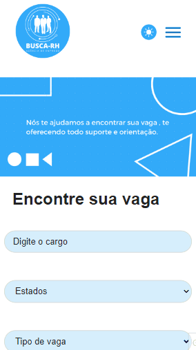

# Busca RH

O projeto consiste em um site de vagas de emprego, onde os usuários podem encontrar informações relevantes sobre vagas de emprego, ler notícias relacionadas ao mercado de trabalho, cadastrar seu perfil profissional e se inscrever nas oportunidades disponíveis.

 

# 📑Índice

#### Visão Geral

#### Projeto

#### Tecnologia Usada

#### Instalação

#### Uso

#### Contribuindo

 

# 👁‍🗨Visão Geral

O projeto foi desenvolvido utilizando React, juntamente com recursos como rotas, context e styled components.

Desktop Design

 

Mobile Design

>

 

# 📋Requisitos do Projeto

- A aplicação deverá ser Single Page Application (SPA);
- Utilizar React.js para o desenvolvimento da aplicação;
- Utilizar Context API para criação do Theme Toggler(Alternador entre tema claro e escuro);
- Utilizar styled-components para estilização dos componentes;
- Utilizar react-router-dom para a navegação entre as páginas;

 

# 📦Projeto

O projeto feito com React e utiliza o context API para alimentar as páginas, além disso foi criado como um SPA (Single Page Application) e faz o direcionamento de páginas atráves da biblioteca React Router Dom. A estilização foi feita com a biblioteca Styled Component.

 

# 💻Funcionalidades

- Navegação entre páginas;
- Menu responsivo para mobile;
- Links internos entre as páginas;
- Validação de formulário;
- Botão de carregar mais vagas;
- Botão de troca de temas.

 

# 🔧Tecnologia Usada

- React
- Styled Components
- React Router DOM

 

# 💾Instalação

1. Clone o repositório ou baixe os arquivos do projeto.
2. Instale as dependências necessárias executando npm install ou yarn install.

 

# 👣Uso

1. Execute o comando npm start ou yarn start para iniciar o servidor de desenvolvimento.
2. Abra o aplicativo em seu navegador da Web navegando até http://localhost:3000.
3. Navegue pela página para testar as funcionalidades.

 

# 👦🏻Autor

## Osmar Viana

 

## 🔗Links

  
   

  
   
  
   
  
   

